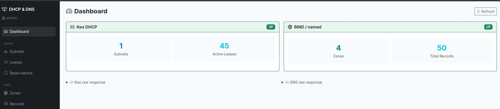

# Kea DHCP & Named DNS Manager

A Flask web application to manage **Kea DHCP** and **BIND/named DNS** services running on the host. The app runs in a Docker container with host networking to communicate with the services.

<p align="center">
  
  
  <a href="https://ghcr.io/ftsiadimos/dhcp-named-manager"></a>
  <a href="https://github.com/ftsiadimos/dhcp-named-manager/blob/main/LICENSE"></a>
</p>


<p align="center">
  
</p>
<p align="center"><em>Dashboard</em></p>

---
## Features

### DHCP (via Kea Control Agent API)
- View / Add / Edit / Delete **subnets** (pools, options)
- View / Add / Delete **reservations** (MAC → IP mapping)
- View / Delete **leases**
- Service status dashboard

### DNS (via dynamic updates & rndc)
- Browse zone records (AXFR)
- Add / Edit / Delete records (A, AAAA, CNAME, MX, TXT, PTR, NS, SRV)
- PTR (reverse DNS) management
- rndc console (status, reload, flush, freeze/thaw, etc.)

## Prerequisites

On the **host machine**:

1. **Kea DHCP** with Control Agent enabled on port 8000:
   ```bash
   systemctl enable --now kea-ctrl-agent
   systemctl enable --now kea-dhcp4-server
   ```

2. **BIND/named** with:
   - Zone transfers (AXFR) allowed from localhost
   - Dynamic updates enabled (or TSIG key configured)
   - `rndc` key available at `/etc/bind/rndc.key`

3. **Docker** (with compose plugin)

## Quick Start

### Option 1 — Pre-built image from GitHub Container Registry

Pull and run directly without cloning the repository:

```bash
docker run -d \
  --name dhcp-dns-manager \
  --network host \
  --restart unless-stopped \
  ghcr.io/ftsiadimos/dhcp-named-manager:latest
```

Or with Docker Compose:

```yaml
# docker-compose.yml
services:
  dhcp-dns-manager:
    image: ghcr.io/ftsiadimos/dhcp-named-manager:latest
    network_mode: host
    restart: unless-stopped
    volumes:
      - ./data:/data
```

```bash
docker compose up -d
```


